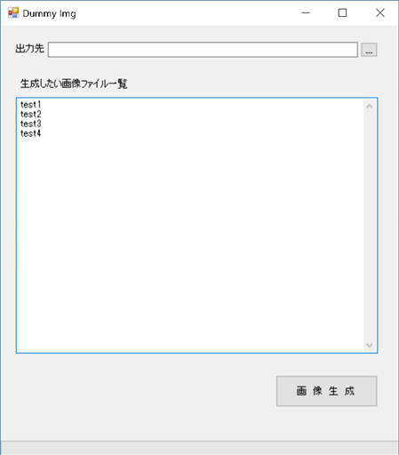

Dummy Image Generate
======================

## Setup
  1. Download. 
     https://github.com/tamutamu/DummyImage/releases/download/1.1.0/DummyImage.zip

## Use
  1. Extract DummyImage.zip and then launch DummyImage.exe.
  2. Input dummy file name in textarea.
  3. press button, then output image file(png).

